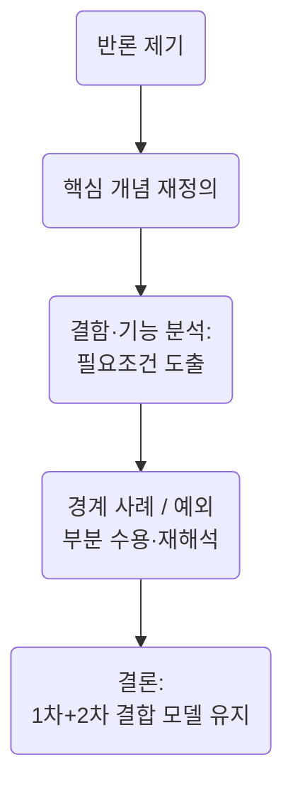

## H. L. A. Hart, 『법의 개념』 제5장 요약 핸드아웃

**주제:** 법이란 무엇인가 – 일차 규칙과 이차 규칙의 결합 모델

---

### I. 논증의 기본 구조

#### 1. 기존 이론(‘강제 명령 이론’)의 부적합성

* 법의 다양한 특징(형법, 권한 규칙, 입법 권위의 계속성 등)을 설명하지 못함
* ‘암묵적 명령’, ‘공무담당자 중심 규칙’ 등 보완 개념도 실패
* 규칙 개념 없이 법은 설명 불가능

#### 2. 새로운 출발: 규칙 이론

* 규칙은 단순한 명령·복종·위협과 구별됨
* 두 종류의 규칙 필요

  * **일차 규칙 (primary rules):** 책무를 부과함
  * **이차 규칙 (secondary rules):** 규칙을 식별, 변경, 적용할 수 있는 권한을 부여함

---

### II. 적극적 입증 논증의 구성

#### A. 전제: 일차 규칙만 존재하는 사회

* 예: 원시 공동체, 비공식 규범체계
* 다음과 같은 **세 가지 결함**이 발생함

  1. **불확실성 (uncertainty)** – 어떤 규칙이 존재하는지 알기 어려움
  2. **정적 성격 (static character)** – 규칙을 의도적으로 변경할 수 없음
  3. **비효율성 (inefficiency)** – 규칙 위반에 대한 최종 판정이나 강제 수단 부재

#### B. 해결책: 이차 규칙의 도입

* 각각의 결함을 대응하는 이차 규칙들

  * **승인 규칙 (rule of recognition)**: 규칙의 존재를 식별
  * **변경 규칙 (rules of change)**: 규칙의 도입·폐지 절차 명시
  * **재판 규칙 (rules of adjudication)**: 위반 여부를 판단할 권한 부여

#### C. 결론

* 일차 규칙과 이차 규칙이 결합된 구조만이 **완전한 법체계**를 구성
* 이 구조 안에서 **유효성, 권한, 입법, 판결, 제재** 등의 핵심 법 개념이 해명됨

---

### III. 규범적 의무 개념 분석

* “\~할 수밖에 없었다(obliged)”와 “의무가 있다(had an obligation)”는 구별되어야 함
* **예측 이론 (predictive theory)** 비판

  * 규칙 위반은 단순히 제재 예측의 근거가 아니라 비판·제재의 **이유(reason)** 또는 **정당화(justification)**
  * 규칙은 \*\*내부 관점 (internal point of view)\*\*에서 이해되어야 함
* 규칙을 지침으로 수용하는 태도가 없다면, ‘의무’ 개념은 성립하지 않음

---

### IV. 예상 반론과 대응 구조

| 반론                    | 요지           | Hart의 대응 전략                           |
| --------------------- | ------------ | ------------------------------------- |
| 국제법도 이차 규칙 없이 법이다     | 경계 사례 제시     | 중심 사례 설명이 이론의 핵심. 국제법에도 최소한의 이차 구조 존재 |
| 1차-2차 규칙 구분은 자의적      | 규칙은 자기참조 가능  | 규칙의 **기능 차이**는 실질적. 분석적 유용성 있음        |
| 승인 규칙도 또 다른 승인 규칙 필요? | 무한 회귀 문제     | 사회적 관행의 수용이 종점 역할을 함                  |
| 도덕 규범도 압력·절차 존재       | 법과 도덕 경계 불분명 | 공무담당 실천의 제도화 여부가 핵심 기준              |
| 소규모 공동체도 법적 효과 가능     | 결함이 치명적이지 않음 | 예외 인정. 그러나 대규모 사회에서는 이차 규칙이 필요조건      |
| 명령 이론에 규칙 요소를 추가하면 충분 | 보완 가능성       | 권한·유효성·입법 등을 설명하려면 규칙 이상의 구조 필요       |

---

### V. 메타-구조: Hart의 대응 방식의 일반 형식

1. **개념 분해 (개념 재정의)**
2. **기능적 필요조건 제시**
3. **경계 사례의 수용과 재해석**
4. **일차-이차 결합 모델의 유지**

---

### VI. 결론: Hart 모델의 철학적 의의

* 법은 단순한 명령 체계가 아니라 **규칙들의 복합적 구조**
* 법적 개념들의 내부 측면을 해명하는 데 핵심 도구 제공
* 이후 장에서는 유효성, 법의 원천, 주권 개념을 이 구조 위에서 재정의함

---

# 논증 버전
---

### 1. ‘적극적 입증’ 논증(constructive argument) 식별 및 개요

Hart가 **“새로운 출발”** 이후 제시하는 부분이 바로 소극적 비판(명령-이론 부정)을 넘어선 **적극적 입증 논증**이다. 핵심 주장:

> “**법이란 ① 일차 규칙(primary rules) + ② 이차 규칙(secondary rules)의 결합이다.**
> 이 결합만이 모든 ‘법적’ 현상을 가장 경제적·포괄적으로 설명한다.”

이 논증은 **세 단계**로 구획된다.

| 단계 | 논증 기능      | 핵심 내용·논리                                                         |
| -- | ---------- | ---------------------------------------------------------------- |
| A  | **실증적 전제** | 인간 조건·사회생활의 보편 사실 제시(폭력·기만 억제 필요 등)                              |
| B  | **결함 도출**  | “오직 일차 규칙만”인 체계를 가정 → ⓐ 불확실성 ⓑ 정적성 ⓒ 비효율성이라는 *세 결함*이 논리적으로 필연    |
| C  | **해결·귀결**  | 각 결함에 対하여 ⓐ 승인 규칙 ⓑ 변경 규칙 ⓒ 재판 규칙을 도입하면 결함이 해소되고, 그 총체가 ‘법’임을 귀결 |

---

### 2. 논증의 형식적 구성 (P = 전제, C = 결론)

1. **P1** 인간은 폭력·절도·기만의 유혹에도 공동생활을 위해 이를 억제해야 한다.
2. **P2** 어떠한 사회도 최소한 이를 규제하는 *일차 규칙* 없이는 존속 불가하다.
3. **P3** 일차 규칙만으로 꾸려지는 체계에는 *(i) 불확실성*, *(ii) 정적성*, *(iii) 비효율성*이 내재한다.
4. **P4** 각 결함은 논리적으로 **특정 유형의 규칙(이차 규칙)** 도입으로만 해소된다.

   * P4-a 불확실성 → “승인 규칙”(rule of recognition)
   * P4-b 정적성 → “변경 규칙”(rules of change)
   * P4-c 비효율성 → “재판 규칙”(rules of adjudication)
5. **C1** 따라서 *(일차 + 이차)* 규칙이 결합된 구조만이 완전한 법체계를 이룬다.
6. **C2** 이를 통해 **유효성·권위·관할·제재** 등 모든 법적 핵심 개념이 설명된다.

---

### 3. 예상 가능한 반론 → 대응 구조

| 예상 반론                                             | 요지                               | Hart-식 대응 전략                                                                                                                    |
| ------------------------------------------------- | -------------------------------- | ------------------------------------------------------------------------------------------------------------------------------- |
| **R1** ‘이차 규칙 없이도 국제법·관습법은 법이다’                   | 국제법엔 중앙 입법·판결·제재가 불완전하지만 법으로 간주됨 | • Hart 역시 ‘borderline cases’ 인정.  핵심은 “중심 사례(core)” 설명력이 우선. • 국제법에도 승인 규범(조약 체결 관행 등)·변경 메커니즘(개정 절차)·분쟁 해결 기구가 최소 형태로 존재한다. |
| **R2** ‘1차-2차 구분은 인위적; 일차 규칙도 자기-변경성을 가질 수 있다’    | 고도로 발달한 관습 규범은 스스로 절차를 포함        | • “자기-언급성(self-reference)” 가능성이 일부 있더라도 분석 편의를 위해 구분이 필요. • 규칙의 *기능* (행위 지시 vs. 규칙 지시)은 여전히 질적으로 다름.                         |
| **R3** ‘승인 규칙 자체는 무엇이 승인되는지 누가 결정? → 무한 회귀’       | 메타-규칙 요구로 regress 발생             | • 승인 규칙은 사실적-사회적 관행에 “정지” (Diehlpunkt)를 둔다; 추가 규칙 필요 없음. • Kelsen Grundnorm과 달리 “실천적 수용”이 종지점 역할.                            |
| **R4** ‘도덕규범도 강한 사회적 압력·변경 절차를 가질 수 있는데 왜 법과 구별?’ | 규칙 유형만으로 법·도덕 선긋기 불가             | • Hart는 “적어도 최소한의 이차 규칙과 공무담당 실천(official practice)의 제도화”를 법의 표지로 제시. • 도덕은 통상 분산된 압력·탈제도화 절차… 정도·기관화 차이가 본질.                     |
| **R5** ‘소규모 호혜 공동체는 이차 규칙 없이도 효과적’                | 결함이 반드시 치명적이진 않다                 | • Hart도 인정: “작은·안정된 공동체” 예외. 그러나 법이론은 *대규모·복합 사회* 설명 목표—“규범적 일반성” 관점에서 여전히 필요조건.                                                |
| **R6** ‘명령-이론 보완(예: 규칙 = 반복 + 제재)으로도 결함 해결 가능’    | “강제 명령”을 더 세분하면 충분               | • 권한부여·유효성·판결 개념은 제재로 환원 불가(내부 관점에서의 정당화 이유·행위구조 설명 실패). • 명령의 ‘발생 조건’과 ‘발효 절차’를 설명하려면 이미 이차 규칙 요소 도입이 불가피.                      |

---

### 4. 반론 대응의 **메타-구조**

모든 반론에 대한 Hart-식 응답은 공통적으로 **(a) 개념 분해 → (б) 필요조건 제시 → (γ) 경계 사례 수용**의 3-단계로 조직된다.

* **B (개념 재정의)**: ‘법’, ‘규칙’, ‘승인’ 등의 기능적 정의로 프레임 전환
* **C (필요조건 분석)**: “분명한 힘(real) + 권위(authoritative) + 변경 가능성”이 모두 충족되어야 한다는 삼항 기준 제시
* **D (경계 사례 처리)**: 국제법·원시사회 등은 *연속체(continuum)* 상의 위치로 설명—모델 수정이 아닌 “등급화된 적용”

---

### 5. 요약

* **적극적 입증 논증**은 \*‘결함 → 해결책 → 총합 = 법’\*이라는 세단계 귀납-연역 혼합 구조.
* 예상 반론들은 주로 ① 필요성 부정 ② 구분 불필요 ③ 경계 사례 제시 유형으로 귀결.
* Hart-식 대응은 **기능 분석**과 **내부 관점** 논지를 통해 반론을 흡수·재배치하면서 “1차+2차 결합 모형”의 설명력을 방어한다.
